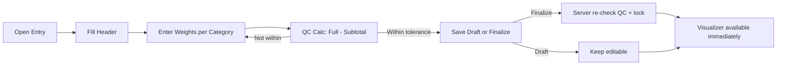

## Levitated Data Tool — Browser-first Wireframe and Architecture

### Purpose and constraints
- **End users**: Must run entirely in a standard web browser with zero installs.
- **Data**: Stored in a single, shared SQLite file (central file scaffold on your network).
- **Precision**: All weights in pounds with three decimals; store as integer millipounds (mlb).
- **QC**: Mandatory reconciliation of “Full Sample” vs. sum of categorized materials.

### Feasibility of true no‑install for users
- **Yes for users**: A browser-based Single-Page App (SPA) requires no installs on user PCs.
- **One host needed**: A small service on a single internal machine must read/write the shared SQLite file (browsers cannot access SMB/UNC files directly for security and file-locking reasons).
- Users visit a URL like `http://intranet/levitated-data-tool` and use the app with no additional software.

### Deployment model
- **Host machine** (server or one managed workstation):
  - Serves static files (HTML/CSS/JS SPA).
  - Exposes a minimal API (JSON) to operate on the single SQLite file in WAL mode.
  - Runs nightly zipped backups of the database file.
- **End users**: Access via browser; no dependencies to install.

### Architecture
```mermaid
graph TD
  U["End User (Browser)"] -->|HTTPS| SPA["Single-Page App (HTML/CSS/JS)"]
  SPA -->|JSON| API["Tiny API Service (one internal machine)"]
  API -->|SQLite (WAL)| DB["Shared SQLite file on network share"]
  API --> LOG["Audit + QC validation"]
  DB --> BAK["Nightly backup (zip rotations)"]
```

### Core screens and wireframes

#### Single Sample Entry
```
+--------------------------------------------------------------+
| Levitated Data Tool — Single Sample Entry                    |
+--------------------------------------------------------------+
| Sample Code: [__________]  Operator: [____]  Bunker: [▼]     |
| Collected At: [YYYY-MM-DD HH:MM]  [Now]                      |
| Sorted At:    [YYYY-MM-DD HH:MM]  [Now]                      |
| Notes: [..................................................]  |
+--------------------------------------------------------------+
| Category           | Weight (lb, 0.001) | Comment            |
|--------------------------------------------------------------|
| Full Sample        | [  0.000 ]         | [                ] |
| Copper             | [  0.000 ]         | [                ] |
| Cu + Attach        | [  0.000 ]         | [                ] |
| Brass              | [  0.000 ]         | [                ] |
| Br + Attach        | [  0.000 ]         | [                ] |
| ICW                | [  0.000 ]         | [                ] |
| Al/Cu Rad          | [  0.000 ]         | [                ] |
| FeAl               | [  0.000 ]         | [                ] |
| Al - Sheet         | [  0.000 ]         | [                ] |
| Al - Cast          | [  0.000 ]         | [                ] |
| Zinc               | [  0.000 ]         | [                ] |
| Stainless          | [  0.000 ]         | [                ] |
| Ferrous            | [  0.000 ]         | [                ] |
| Coins              | [  0.000 ]         | [                ] |
| Lead               | [  0.000 ]         | [                ] |
| CB                 | [  0.000 ]         | [                ] |
| Other              | [  0.000 ]         | [                ] |
| Non-Metallics      | [  0.000 ]         | [                ] |
+--------------------------------------------------------------+
| QC: Full=[0.000]  Subtotal=[0.000]  Delta=[0.000]  Status:[ ]|
| Tolerance: 0.005 lb                                          |
+--------------------------------------------------------------+
| [Save Draft]  [Finalize Sample]  [Clear]                     |
+--------------------------------------------------------------+
```

Interaction notes
- Keyboard-first grid; step 0.001; clamp to ≥ 0; auto-round to three decimals.
- Live QC panel; “Finalize” disabled until QC passes; “Save Draft” allowed.
- Required fields: `sample_code`, `collected_at`, `sorted_at`, `operator`, `bunker`, and “Full Sample” > 0.

#### Visualizer (sortable by bunker/date/status)
```
+--------------------------------------------------------------+
| Filters: Bunker [▼]  From [YYYY-MM-DD]  To [YYYY-MM-DD]      |
|          Status [Any|Draft|Finalized]  [Refresh]             |
+--------------------------------------------------------------+
| Sample Code | Bunker | Sorted At        | Operator | Status  |
| Full Sample | Copper | Brass | ... (pivoted categories)      |
|--------------------------------------------------------------|
| S-0001      | Line A | 2025-08-12 13:40 | EB       | Final.  |
|   45.761    | 12.340 | 7.900 | ...                         |
| ...                                                      ... |
+--------------------------------------------------------------+
| [Export CSV] [Open Sample]                                   |
+--------------------------------------------------------------+
```

#### Bunkers Admin (light)
```
+--------------------------------------------+
| Bunkers                                    |
|--------------------------------------------|
| Name         | Active | Sort | [Edit] [X]  |
| Unspecified  |  Yes   |  0   |             |
| Line A       |  Yes   | 10   |             |
| Line B       |  Yes   | 20   |             |
| ...                                      ...|
+--------------------------------------------+
| [Add Bunker]                               |
+--------------------------------------------+
```

### Process flow


### Data model (SQLite, single file)
- `samples`: `id`, `sample_code` (unique), `bunker_id`, `collected_at`, `sorted_at`, `operator`, `notes`, `status` (`draft`/`finalized`), `created_at`, `finalized_at`.
- `categories`: fixed list including `Full Sample`; `is_qc_total` flag; `sort_order`.
- `sample_items`: `sample_id`, `category_id`, `weight_mlb` (integer), `comments`.
- Views for UI/exports:
  - `v_sample_qc`: full vs subtotal, delta, pass/fail.
  - `v_sample_items_wide`: one-row-per-sample pivot of category weights (lb).
- Trigger: block `status='finalized'` if “Full Sample” missing, ≤ 0, or QC delta exceeds tolerance.

### Validation and QC
- All weights entered/displayed in lb to 3 decimals; stored as `mlb = round(lb * 1000)`.
- QC: `delta = full_mlb - subtotal_mlb`; pass if `|delta| ≤ tolerance_mlb` (default 5 = 0.005 lb).
- No negative weights; “Full Sample” required and > 0.

### Technical blueprint (for build)
- **Frontend**: SPA (vanilla JS or React). Deployed as static files. Browser-only for users.
- **Backend**: tiny API service on a single host you control (choices):
  - .NET Minimal API (single-file publish), or
  - Go (single static binary), or
  - Node (if allowed on that one host).
- **Database**: SQLite file on network share in WAL mode. Path examples:
  - Local default: `C:\\ProgramData\\LevitatedDataTool\\data.db`
  - Shared UNC: `\\\\SERVER\\Share\\LevitatedDataTool\\data.db`
- **Backups**: nightly zipped backup with 30-day retention.
- **Auth (later)**: Windows Integrated Auth via reverse proxy (IIS) or app-level roles.

### Rollout plan
1. Build SPA entry screen and client-side QC.
2. Implement minimal API endpoints: categories, bunkers, sample upsert, finalize, queries.
3. Apply schema and trigger; seed categories and a default bunker.
4. Add visualizer (summary and pivot endpoints) and CSV export.
5. Harden: logging, backups, auth, and read-only auditor view.


